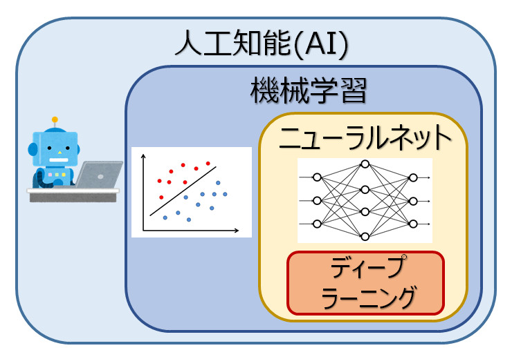

# 人工知能(AI)とは
人工知能(Artificial Intelligence)は、「推論、認識、判断など、人間と同じ知的な処理能力を持つ機械（情報処理システム）」であると言われていますが、
専門家によってもその解釈が異なり、人工知能の明確な定義はありません。

## 人工知能の大まかな分類
人工知能(AI)には、さまざまな手法があり、大まかには以下のように分類することができます。

 

1. 人工知能
一番広い概念

2. 機械学習
非常に多くのサンプルデータをもとに入力と出力の関係を学習

3. ニューラルネットワーク
機械学習の手法の１つで、脳の神経細胞の情報処理を模して階層構造のつながりで

4. ディープラーニング
ニューラルネットワークの階層をより多階層とすることで、複雑な問題に対してより精度の高い解を出すことができる。

