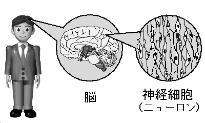
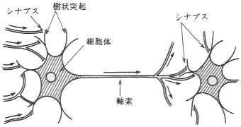

# ニューラルネットワークとは
ニューラルネットワークは、脳の神経細胞(ニューロン)の情報処理を模した機械学習の手法の１つで、
大量データを繰り返し与えて入力と出力の関係を学習し、分類や回帰等の問題の解を出す。

## ニューロン(神経細胞)とは
ニューロンとは脳にある神経細胞のことで、 生体の細胞の中で 情報処理用に特別な分化を遂げた細胞です。 
人間の脳の中には約１４０億個のニューロン(神経細胞)がある といわれています。 脳を生理学的に調べてたところ、
小さな細胞(ニューロン)が網の目のようにつながり、 ネットワークをなしていることがわかっています。
その各ニューロンは他の多数のニューロンから信号を受け取り、 それを総合して次のニューロンに信号を伝えています。
このように脳の中では たくさんのニューロンのつながりによって 情報を処理しているのです。



## 実際のニューロンの構造
ニューロンは細胞体、 樹状突起、軸索 の３つの部分からなります。 
細胞体が本体で、樹状突起が入力部分、軸索が出力部分になっています。 つまりニューロンは入出力を持った情報処理素子です。 
ニューロンの出力は他のニューロンの入力部分につながっていて、 複雑に結合したニューラルネット(神経回路網)を構成しています。 
つまり、出力を担う軸索は途中で何本にも枝分かれして、多数個の 他のニューロンの樹状突起につながっています。この結合部を シナプスと呼びます。 
ニューロンの情報は、１つの細胞の軸索から 他の細胞の樹状突起へとシナプスを介して伝えられます。

 

## ニューロンの働き
　次に１つのニューロンの働きについて説明します。
 ニューロン内部の電位を膜電位といいますが、樹状突起へ入ってくる ニューロンの入力信号によって この膜電位が変化します。
　そしてこの膜電位がある閾値(しきいち)を越えると、 ニューロンは興奮して、 パルスを出します。
 このパルスが出力信号となって軸索を 伝わっていきます。パルスが他のニューロンとの結合点のシナプスに 達すると、
 軸索の末端から伝達物質が放出されます。 この物質が受け手のニューロンの樹状突起に作用して、 そのニューロンの膜電位を変化させます。
　伝達物質には、 膜電位を高める働きをするもの(興奮性)と、 低める働きをするもの(抑制性)とがあります。 
 このようにして、ニューロンからニューロンへ信号が 伝達されていくのです。
 
 ```mermaid
  graph TD;
      シナプスを通じて樹状突起がパルスを受け取る
      -->ニューロンに入力信号が加わる
      -->膜電位が上昇する
      -->膜電位がしきい値を超えるとバルスを発生する
      -->パルスが軸索を伝わる
      -->シナプスを通じて次のニューロンにパルスを伝える;
```

## ニューロンモデルの構造
まず１つのニューロンを多入力１出力の素子でモデル化をします。 このモデルを用いればニューロンの構造も簡単に示すことができます。 実際のニューロンと比べてみると、 シナプスは結合荷重に、 細胞体はユニットに対応しています。

　結合荷重とは、結合の強さを表す量で、 膜電位が入力の影響を受けて変化する大きさのことです。 つまり結合荷重は任意の実数値で、入力に重みをかける役割をしています。 これは、シナプスが異なる伝達効率を持つことをあらわしています。 興奮性のシナプス結合に対しては 結合荷重は正となり、 抑制性のシナプス結合に対しては 結合荷重は負となります。
 
　ユニットはしきい値演算をするためのものです。 入力信号の強さに結合荷重を掛けたものを すべての入力について計算し足し合わせます。 つまり、入力に重みをかけた総和を計算するのです。 そして、その総和がしきい値を 超えたかどうかを判定し、それに合った出力を出します。

